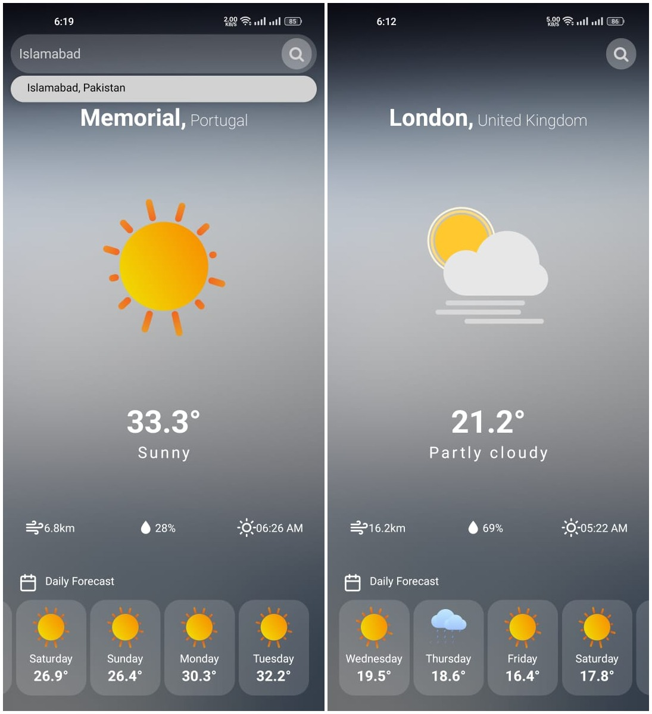

# Nimbus
# 🌤️ Nimbus - Weather Forecast App (React Native)

**Nimbus** is a modern and responsive weather forecasting app built with **React Native**. It uses animated weather visuals, stores user preferences, and provides real-time and weekly forecast details including temperature, humidity, wind speed, and sunrise time.


## ✨ Features

- 📍 Get current weather for your location
- 📅 7-day weather forecast
- 🌈 Lottie animations for weather conditions
- 💾 Uses AsyncStorage to store last used location
- 🌐 Fetches real-time weather data from Weather API
- 📱 Clean and intuitive UI for mobile devices


## 📸 Screenshots




## 🔧 Tech Stack

- **React Native** (Expo)
- **Lottie for React Native**
- **AsyncStorage** for local data persistence
- **WeatherAPI** or any weather API (like OpenWeatherMap)
- **Axios** for API requests


## 🧠 How It Works

- On launch, Nimbus loads the last searched location using AsyncStorage.
- Weather data is fetched from the API based on user location or search query.
- Current weather and a 7-day forecast are displayed with animations.
- Lottie animations adapt based on weather conditions like sunny, cloudy, rainy, etc.


## 🚀 Getting Started

### 1. Clone the Repository

```bash
git clone https://github.com/MalikAdilll/Nimbus.git
cd Nimbus

